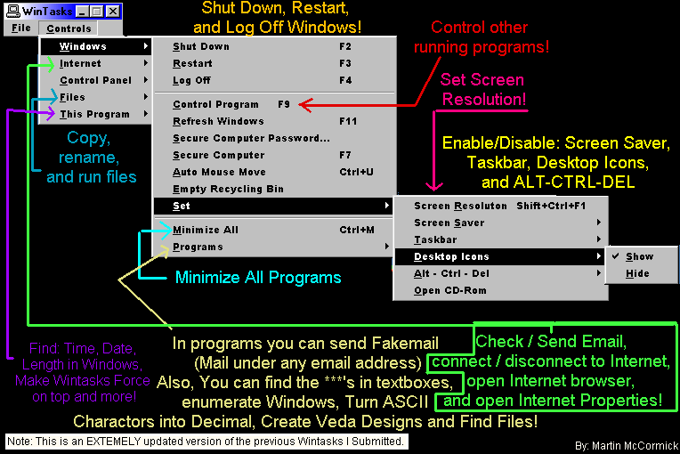



## WinTasks \(Do hundreds of amazing tasks with API and more\!\) \(updated\)

### Description

Wintasks is a program capable of doing hundreds of Windows tasks. Wintasks can: Shut down Windows, restart windows, log off Windows, control open programs, "refresh windows," empty recycling bin, set screen resolution, disable/enable; taskbar, ALT-CTRL-DEL, desktop icons, screen saver. Also Wintasks can send email, recieve email, send "fakemail" (mail under any address), connect/disconnect to internet, open anything in control panel, copy/rename/run files, find: time, date, cpu usage, and length in Windows, secure the computer with a password you can set, find the ***'s in password boxes, enumerate windows, convert keys to ASCII decimal, find files, open Winfiles, Minimize all windows, create Veda designs, open the CD-Rom drive, and auto mouse move. The program can be FORCED on top and stay above screensavers! Wintasks can do all this and MUCH more, within a small form that can be minimized to the system tray! Wintasks has the power to control running applications and to kill viruses! (This is an extremely updated version of the previous Wintasks I submitted) Includes TONS of API and is a great reference if you don't know a certain API calI. Please Vote if you like it!
 
### More Info
 

             |
---                |---
**Submitted On**   |2000-10-18 08:07:24
**By**             |[Wåzerface](https://github.com/Planet-Source-Code/PSCIndex/blob/master/ByAuthor/w-zerface.md)
**Level**          |Advanced
**User Rating**    |4.4 (233 globes from 53 users)
**Compatibility**  |VB 5\.0, VB 6\.0
**Category**       |[Complete Applications](https://github.com/Planet-Source-Code/PSCIndex/blob/master/ByCategory/complete-applications__1-27.md)
**World**          |[Visual Basic](https://github.com/Planet-Source-Code/PSCIndex/blob/master/ByWorld/visual-basic.md)
**Archive File**   |[CODE\_UPLOAD1078510192000\.zip](https://github.com/Planet-Source-Code/w-zerface-wintasks-do-hundreds-of-amazing-tasks-with-api-and-more-updated__1-12134/archive/master.zip)

